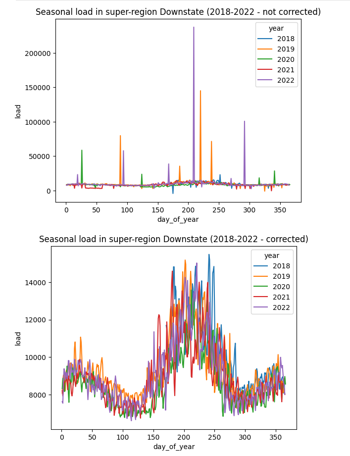
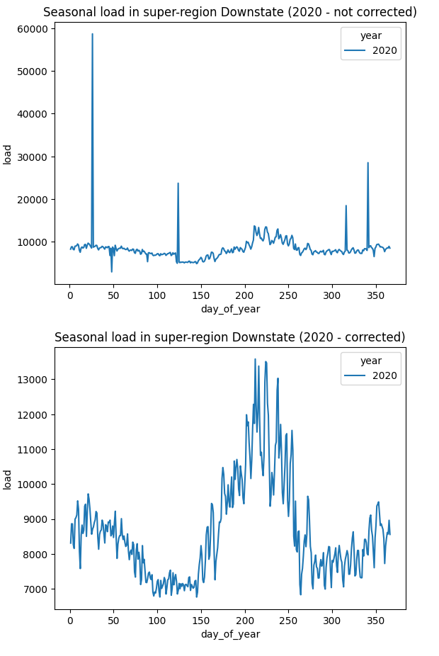

# Time Series : Anomaly detection and correction (ADC)

This notebook analyzes power demand time series in order to detect and correct anomalies (outliers & missing data)

NB: the power data is retrieved from an sqlite db, but the ADC can be applied to any other source.

***
#### Below the results of the detection/correction for all years (top: not corrected / down: corrected)
***

***
#### Below the results of the detection/correction for the year 2020 only (top: not corrected / down: corrected)
***

